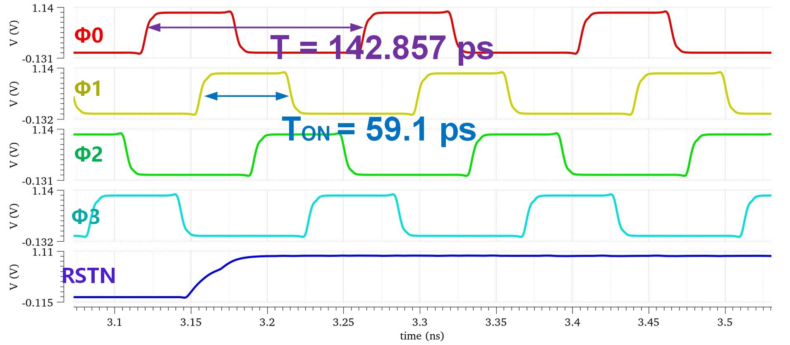
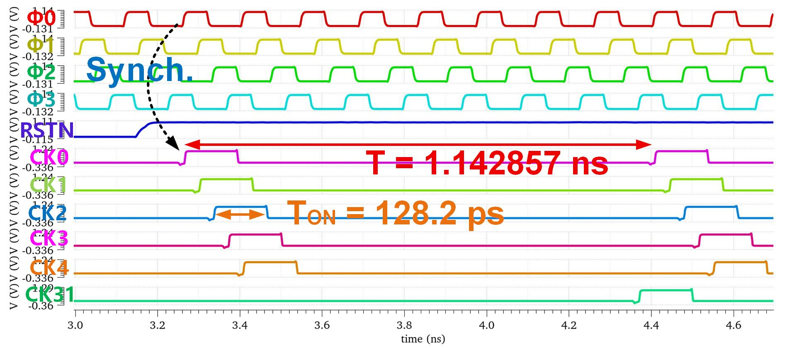
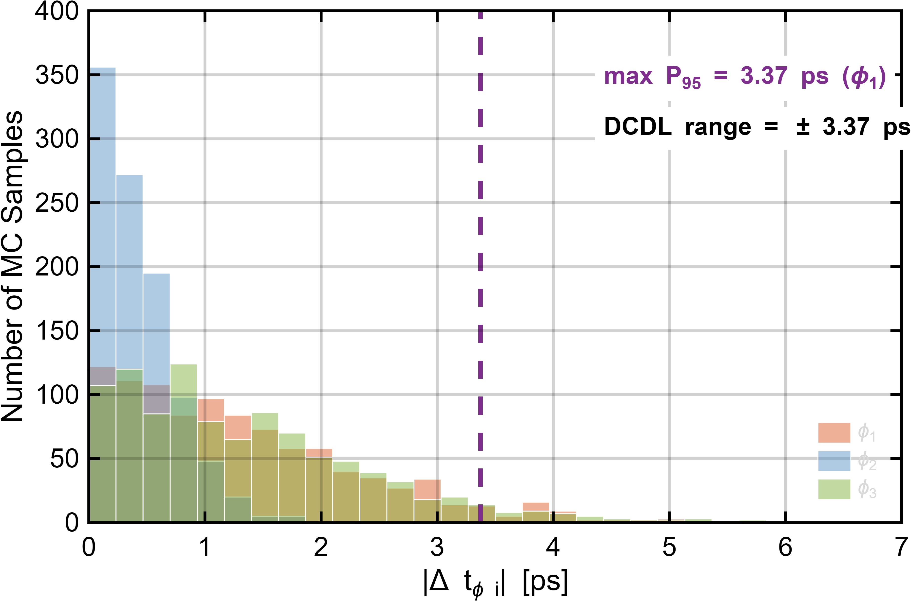

# 多相时钟与 DCDL 仿真

多相时钟产生电路以 14 GHz 差分输入时钟为源，经 CML 二分频产生 4 相 7 GHz 时钟，再经分频器、移位寄存器和占空比调节产生 32 相 875 MHz 子 SAR ADC 采样时钟。

| 图 | 说明 |
|---|---|
|  | TT corner 4 相时钟瞬态 |
|  | TT corner 32 相子采样时钟瞬态 |
|  | 第一级 4 相采样时钟 skew Monte Carlo |

4 相主采样时钟相邻相位间隔约为 `T_7G/4`，子采样时钟占空比约 11%，小于 `1/8`，保证组内非交叠。根据主相位 skew Monte Carlo，DCDL 需要覆盖约 `-3.4 ps` 至 `+3.4 ps` 的残余时序误差。DCDL 电路本身的 delay-code 仿真见 `../dcdl/`。
