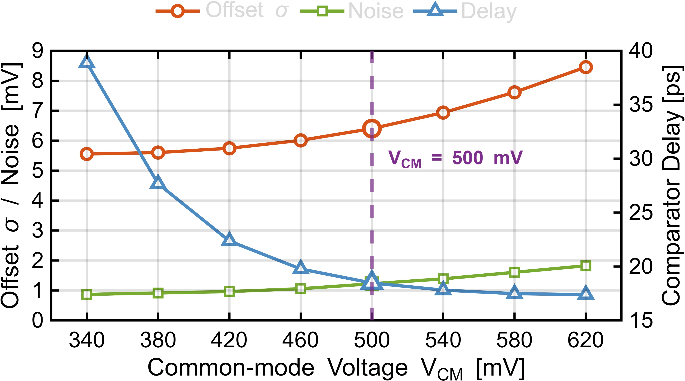
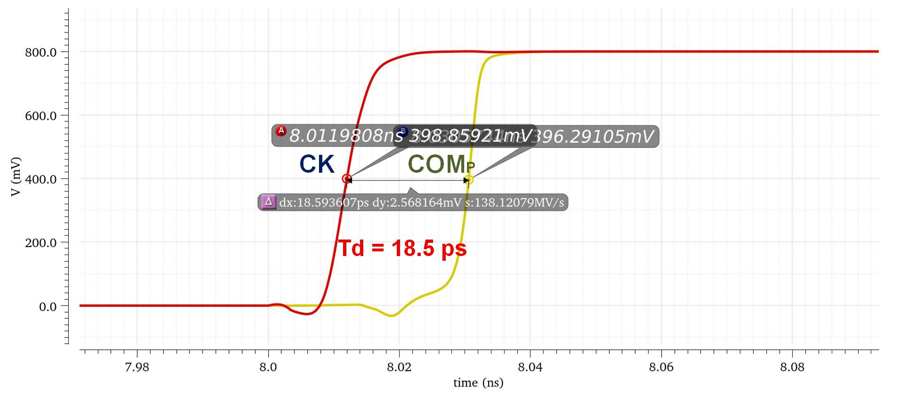

# Strong ARM 比较器仿真

本目录保存 Strong ARM 动态比较器的输入共模折中和瞬态仿真。比较器及后级逻辑使用 0.8 V 标称供电，输入共模选取 500 mV。

| 图 | 说明 |
|---|---|
|  | 比较器速度、噪声和失调随输入共模变化 |
|  | TT corner 比较器瞬态 |

TT corner 下比较器输入等效噪声约 1.22 mV，判决时间约 18.5 ps，单次比较能耗约 20.4 fJ。比较器 3-sigma offset 约 18 mV，计入 OS 校准覆盖范围。
