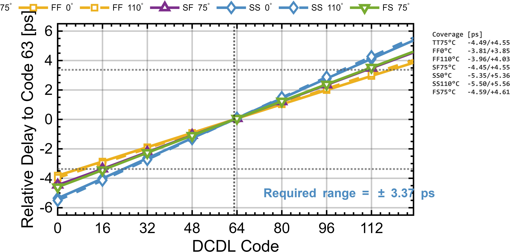

# DCDL 仿真

DCDL 采用可调负载电容结构，用于接收 DSP 端 Skew 校准方向码并调节 4 相主采样时钟延迟。

| 图 | 说明 |
|---|---|
|  | 不同 corner 下 DCDL 延迟随控制码变化 |

以控制码 63 为参考零点，DCDL 最小单边覆盖范围约 3.81 ps，大于所需的约 +/-3.37 ps；按 7-bit 等效控制精度计算，最差平均步进约 87 fs。
