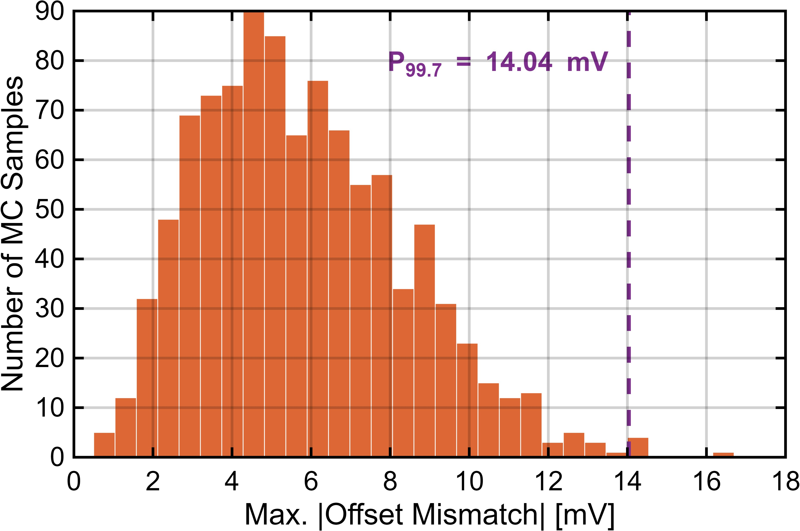
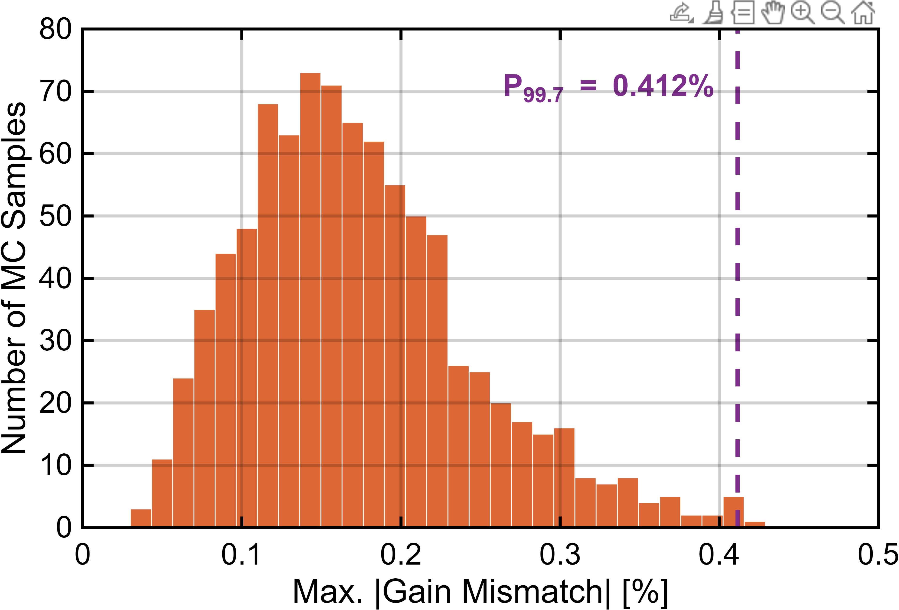

# 采样前端失配仿真

本目录保存 `2 x 2 x 8` 分层采样前端的 Monte Carlo 失配统计。仿真末端接入子 SAR ADC 采样电容，用于估计 AFE 对 DSP OS/Gain 校准范围的贡献。

| 图 | 说明 |
|---|---|
|  | 采样前端 offset mismatch 统计 |
|  | 采样前端 gain mismatch 统计 |

根据 99.7% 分位点，采样前端贡献的相对失调校准范围约 14 mV，增益失配约 0.4%。
