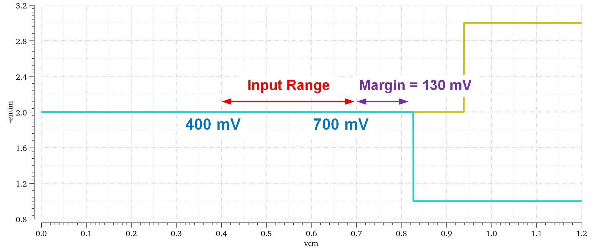
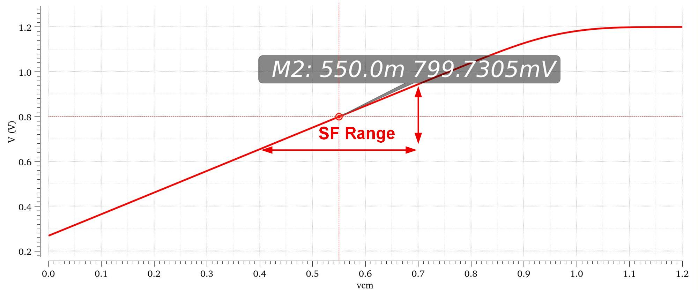
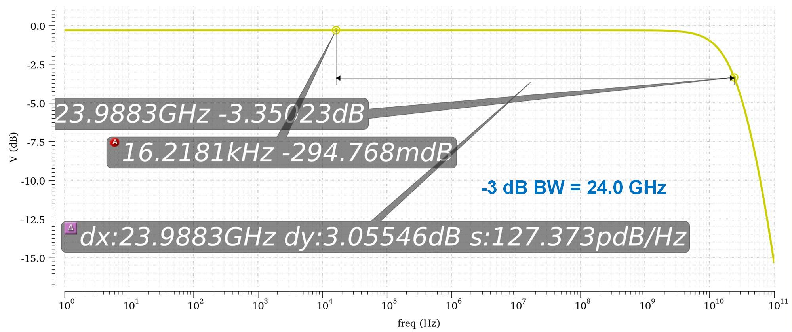
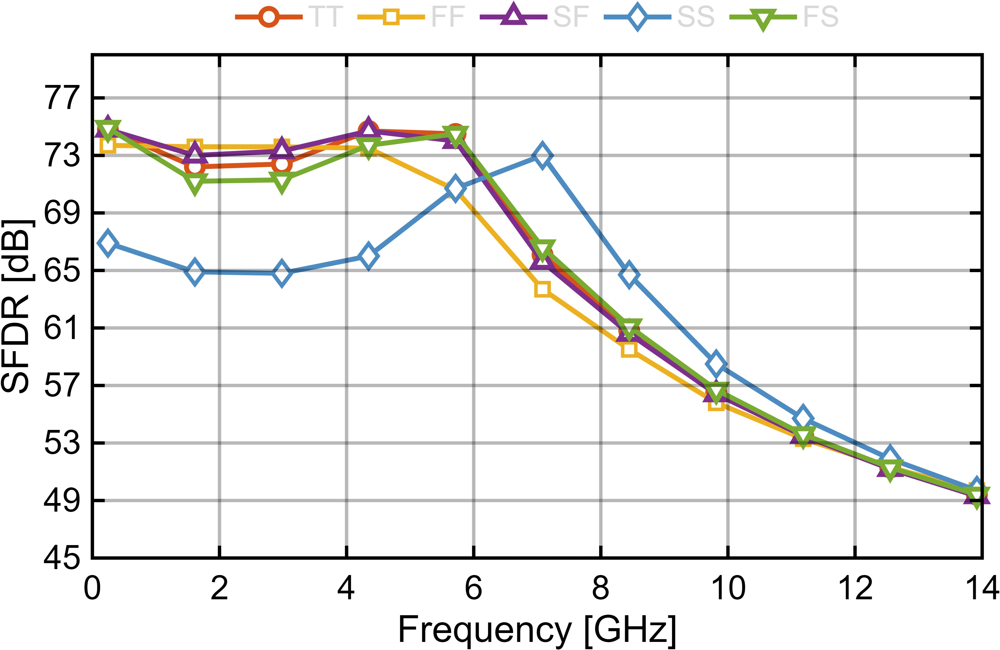

# 输入缓冲器仿真

输入缓冲器采用源跟随器结构，电源电压 1.2 V。仿真负载包含后级 Rank-1 自举开关最差导通电阻 `45 ohm` 和采样电容 `80 fF`。

| 图 | 说明 |
|---|---|
|  | TT corner MOS 管工作区 |
|  | TT corner 直流传输特性 |
|  | TT corner 带载频率响应 |
|  | 输入缓冲器 SFDR 随输入频率变化 |

不同 corner 下输入缓冲器带宽均大于 22 GHz。目标输入频率范围内 SFDR 高于 48 dB，满足采样前端线性度要求。
