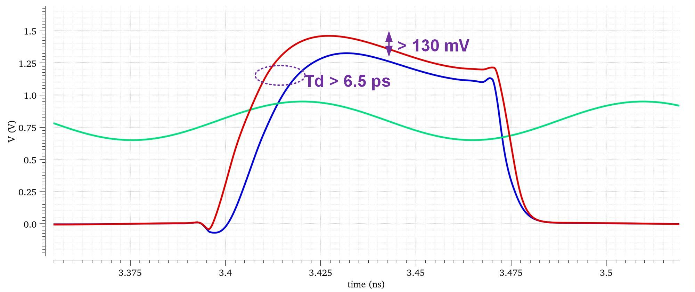
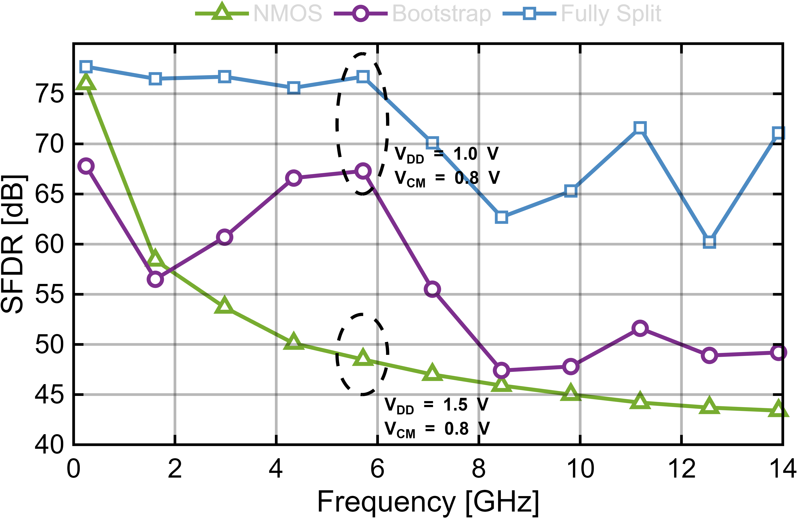

# Rank-1 采样器仿真

Rank-1 采样器采用全分裂自举开关。节点 X 与 Y 分离，X 仅用于自举主开关，以降低关键自举节点寄生；辅助管用于加快自举过程，dummy 管用于抑制关断耦合。

| 图 | 说明 |
|---|---|
|  | 全分裂自举开关与参考结构的瞬态对比 |
|  | 不同采样开关结构的 SFDR 对比 |

在 24 fF 自举电容条件下，全分裂结构使自举电压额外提升约 130 mV，开关导通提前超过 6.5 ps，并在高输入频率下取得更好的采样线性度。
