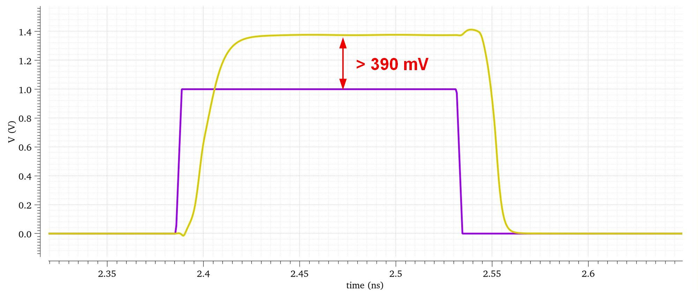

# Rank-2 采样器仿真

Rank-2 采样器位于子 SAR ADC 输入端，采用时钟升压电路降低采样开关导通电阻。电源电压为 1 V，升压电容选取 20 fF。

| 图 | 说明 |
|---|---|
|  | 不同 corner 下时钟升压瞬态仿真 |

仿真结果显示，不同 corner 下子 SAR 前端采样开关导通电阻不超过 40 ohm，可满足 CDAC 采样和子缓冲器负载设计假设。
