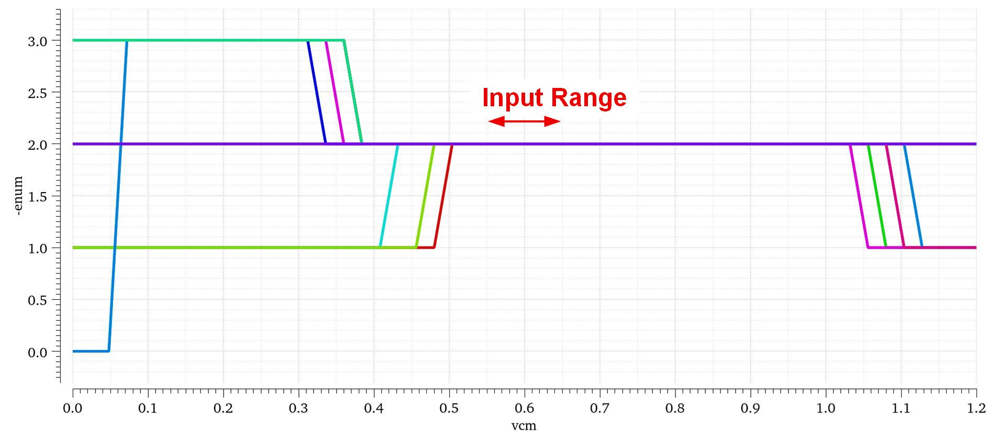
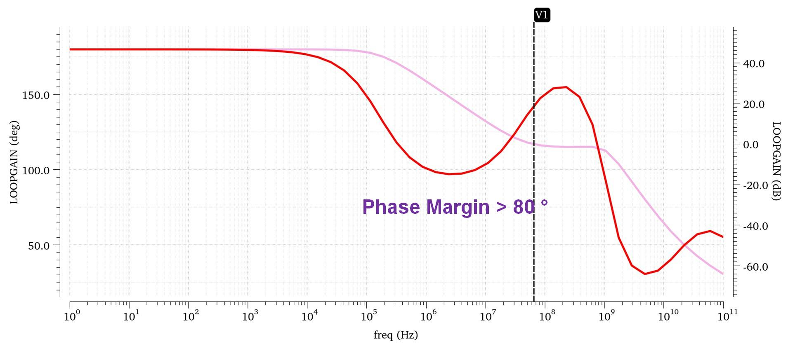
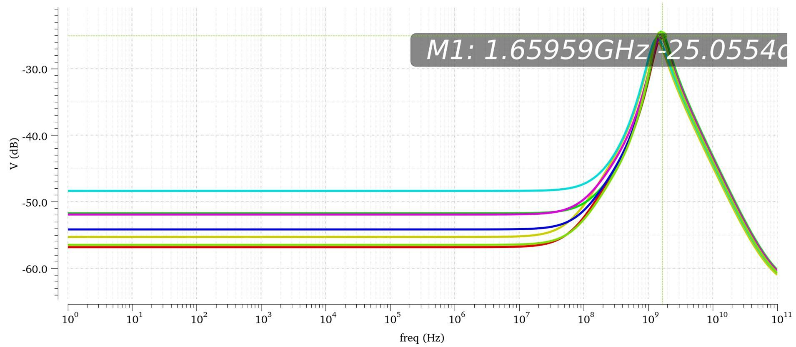
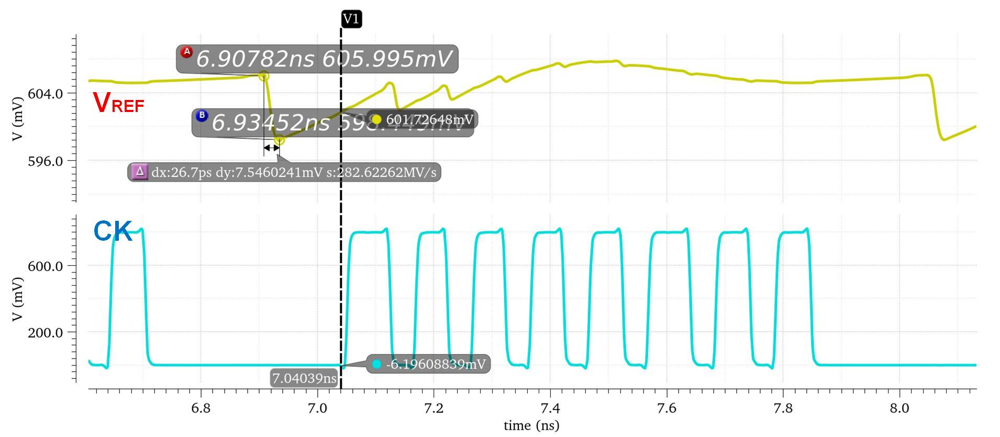
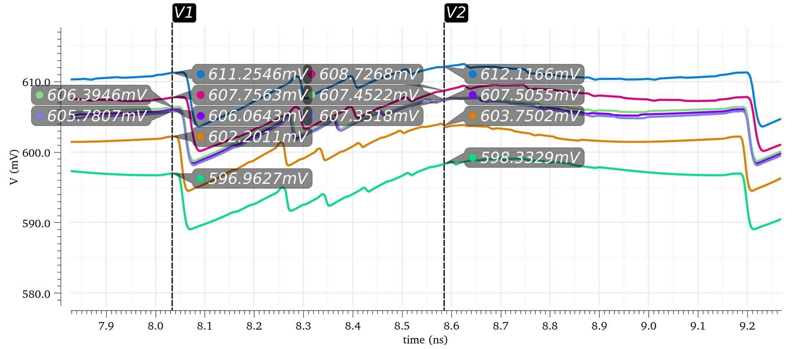
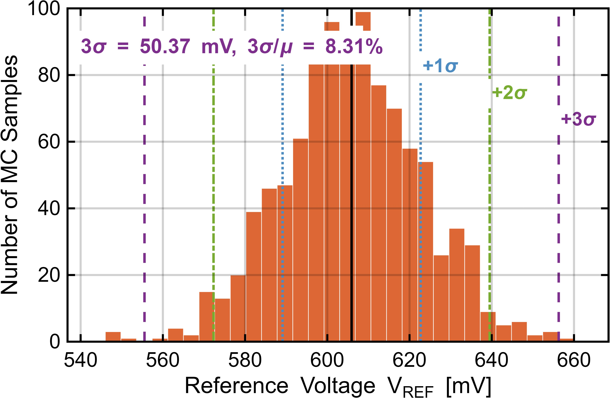

# 基准缓冲器仿真

基准缓冲器采用 SSF 结构，配合 4.5 pF 片上去耦电容和带 1-bit redundancy 的 CDAC，负责在最坏码字切换下快速恢复基准电压。

| 图 | 说明 |
|---|---|
|  | TT corner MOS 管工作区 |
|  | SSF 内部环路稳定性 |
|  | 不同 corner 下 PSRR |
|  | TT corner 最坏码字转换下基准瞬态 |
|  | 不同 corner 下最坏码字转换基准瞬态 |
|  | 基准电压失配 Monte Carlo |

最坏转换中基准从 606 mV 下跌至 598 mV，MSB 比较前恢复到 601.7 mV。不同 corner 下第五次比较前基准误差小于 2 mV，基准失配对增益失配贡献约 8%。
