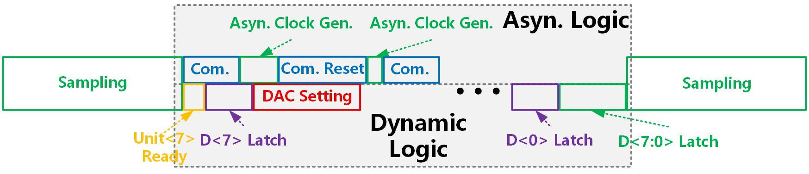
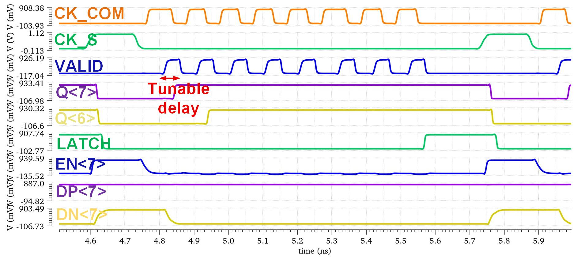
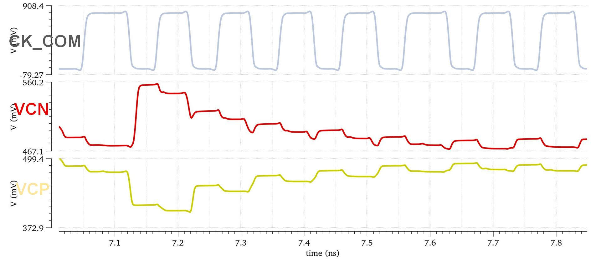
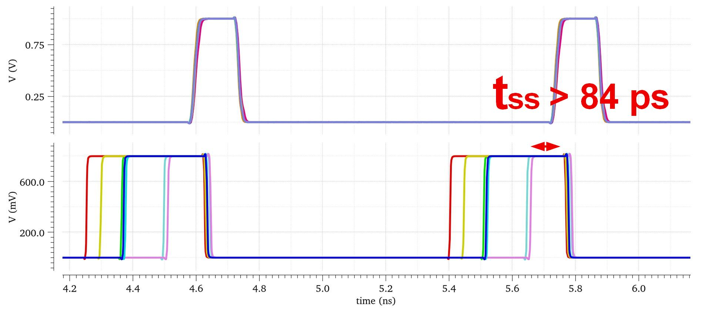

# SAR 逻辑与异步时钟仿真

本目录保存 SAR 动态逻辑、异步时钟链和完整子 SAR ADC 时序仿真。该部分用于验证 875 MS/s 子 ADC 转换周期内，比较器、CDAC 建立和动态逻辑锁存之间的时序裕量。

| 图 | 说明 |
|---|---|
|  | SAR ADC 异步时序分配 |
|  | TT corner 动态逻辑时序 |
|  | TT corner 异步逻辑与 DAC 建立过程 |
|  | 不同 corner 下子 SAR 整体时序 |

仿真结果表明，在最慢 corner 下，单次转换仍留有 84 ps 以上裕量，满足 32 路时间交织结构对子 ADC 转换速度的要求。
