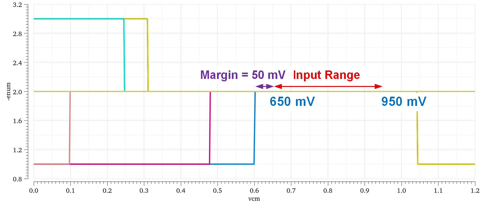
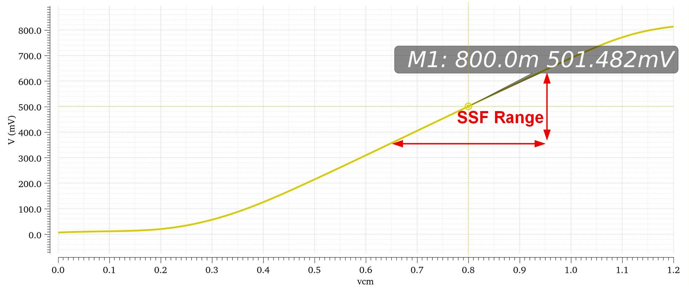
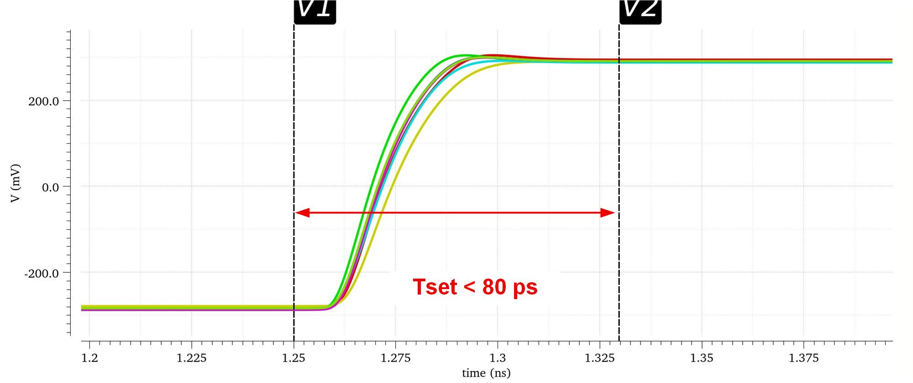
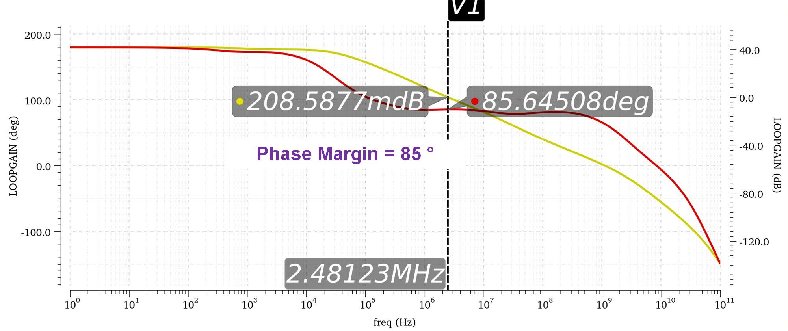

# 子缓冲器仿真

子缓冲器采用全差分 Class-AB 超级源跟随器，用于驱动每组 8 个子 SAR ADC。仿真负载按子 SAR 前端采样网络设置为 `40 ohm + 120 fF`。

| 图 | 说明 |
|---|---|
|  | TT corner MOS 管工作区 |
|  | TT corner 直流传输特性 |
|  | 不同 corner 下阶跃建立过程 |
|  | TT corner CMFB 环路稳定性 |

子缓冲器在 Nyquist 附近输出阻抗小于 40 ohm，CMFB 相位裕度大于 80 度，所有 corner 下最差阶跃建立时间小于 80 ps。
