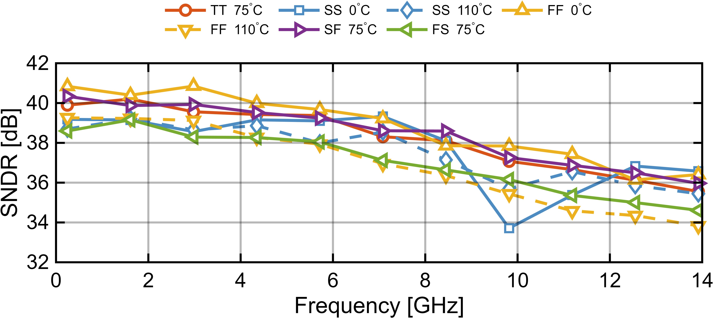
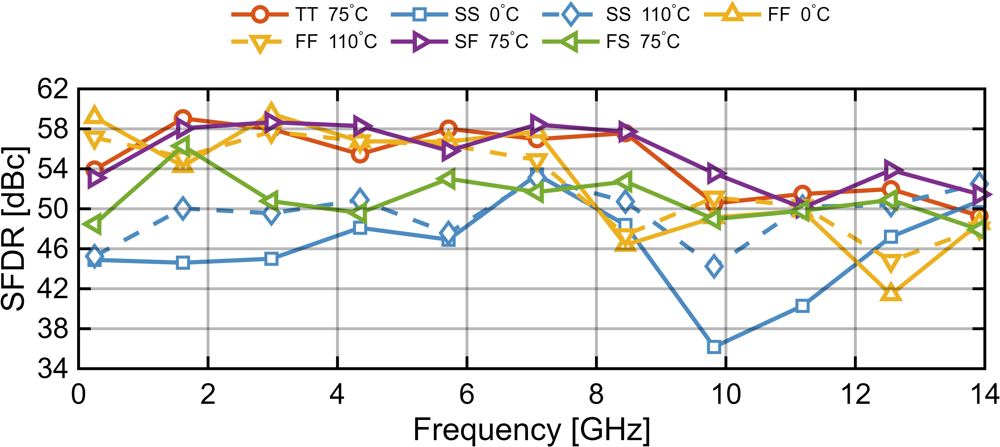
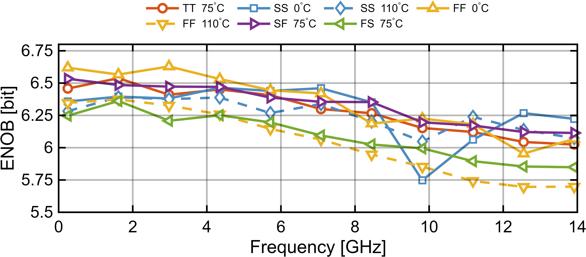
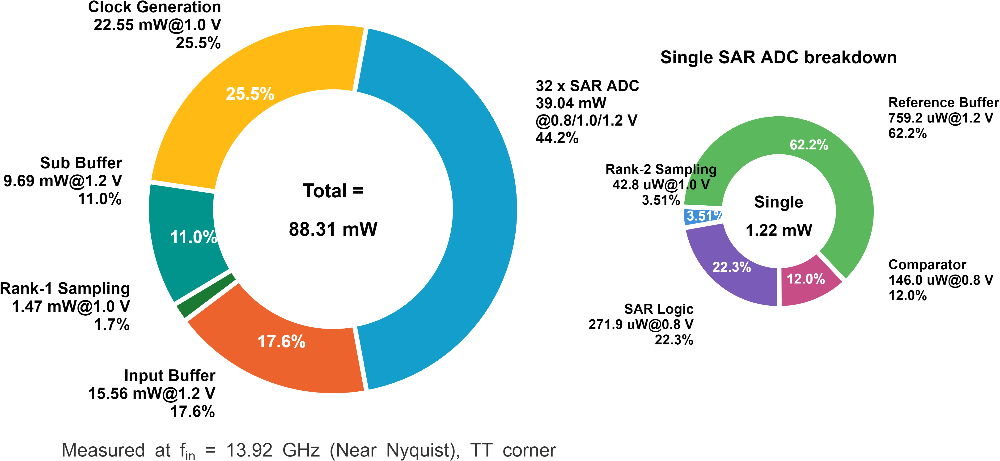

# 顶层动态性能与功耗仿真

本目录保存 32 路 TI-SAR ADC 重组输出后的系统级动态性能和功耗分布仿真。

| 图 | 说明 |
|---|---|
|  | 不同 corner 下 SNDR vs. input frequency |
|  | 不同 corner 下 SFDR vs. input frequency |
|  | 不同 corner 下 ENOB vs. input frequency |
|  | TT corner 功耗分布 |

系统级仿真输入为共模 550 mV、幅度约 +/-295 mV 的差分正弦，FFT 点数 1024。TT corner 近 Nyquist 输入时 ENOB > 6-bit，SFDR > 46 dBc；总核心功耗 88.31 mW，Walden FoM 48.6 fJ/conv-step。
