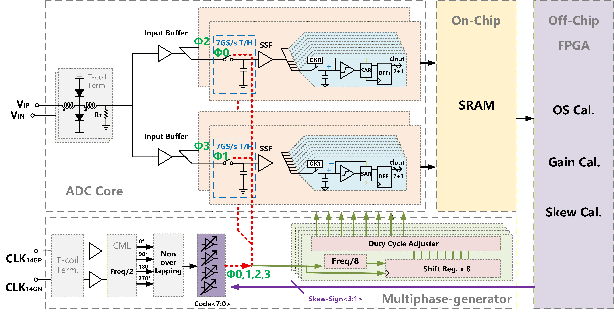

# TI-SAR ADC 项目交付说明

## 项目概览

本项目面向 56 Gb/s PAM-4 接收机，交付一款基于 12 nm FinFET 工艺的 28 GS/s、32 通道时间交织逐次逼近型 ADC（TI-SAR ADC）设计资料。系统采用 `2 x 2 x 8` 分层交织架构，由采样前端、32 个 875 MS/s 子 SAR ADC、多相时钟/DCDL 和片外 DSP 校准模块组成。

当前交付包含 ADC 规格书、模拟/系统设计文档、关键原理图截图、关键仿真图，以及已完成的 DSP 校准代码。模拟电路结果为原理图级前仿真；完整 layout、寄生参数提取和全芯片后仿不在当前交付范围内。



## 核心指标

| 项目 | 指标 |
|---|---|
| 应用场景 | 56 Gb/s PAM-4 receiver |
| 工艺 | 12 nm FinFET |
| ADC 架构 | 32-channel TI-SAR ADC |
| 交织结构 | `2 x 2 x 8` hierarchical interleaving |
| 总采样率 | 28 GS/s |
| 子 ADC 采样率 | 875 MS/s |
| 分辨率 | 7-bit + 1-bit redundancy |
| 输入共模 | 550 mV |
| 差分输入摆幅 | 600 mVpp |
| 目标动态性能 | ENOB >= 5.5-bit, SFDR >= 45 dBc |
| 前仿真结果 | Near Nyquist: ENOB > 6-bit, SFDR > 46 dBc |
| TT 代表值 | SNDR 35.6 dB, SFDR 49.3 dBc |
| 核心功耗 | 88.31 mW |
| Walden FoM | 48.6 fJ/conv-step |

## 系统结构

差分输入信号先经过片上匹配网络和 2 路输入缓冲器。每个输入缓冲器驱动 2 个 Rank-1 全分裂自举采样器，形成 4 路第一级采样保持输出。每一路第一级输出再经过全差分 Class-AB 子缓冲器，驱动 8 个 875 MS/s 子 SAR ADC。32 路输出在数字域重组，并由 `dsp/` 中的校准模块处理失调、增益和采样时序偏斜。

模拟 ADC 端向片外 DSP 提供 32 路子 ADC 数据。DSP 完成 OS/Gain 校准和 Skew 偏斜方向检测后，将 Skew 符号码通过 SPI 写回 ADC 端 DCDL 控制寄存器。DCDL 每次按 1 LSB 更新控制字，完成后台闭环调节。

## 交付目录

```text
ti-adc-project/
├── readme.md                  # 项目交付入口
├── spec.md                    # ADC 规格书
├── todo.md                    # 后续待完善事项
├── design/                    # 模拟与系统设计交付包
│   ├── source.md              #   Virtuoso 原工程路径、论文来源与交付边界
│   ├── schematic/             #   原理图截图与索引
│   ├── cons/                  #   顶层规格、模块约束、失配预算
│   ├── sim/                   #   模块级与顶层仿真图、仿真结论
│   └── ref/                   #   设计参考文献与资料来源说明
└── dsp/                       # 已完成的校准算法与 RTL
    ├── matlab/                #   MATLAB 行为级建模与校准验证
    └── verilog/               #   Verilog RTL、testbench、脚本与仿真数据
```

| 入口 | 内容 |
|---|---|
| `spec.md` | 目标规格、模块规格、校准接口和验证状态 |
| `design/source.md` | 原 Virtuoso 工程路径、cell 映射、论文来源、交付边界 |
| `design/schematic/README.md` | Cadence 原理图截图索引 |
| `design/cons/README.md` | 顶层规格、模块约束、失配预算 |
| `design/sim/README.md` | 模块级和顶层仿真图片、仿真设置与结论 |
| `design/ref/README.md` | 设计参考文献、论文来源和资料边界说明 |
| `dsp/reference.md` | 校准算法参考文献 |

## DSP 校准

`dsp/` 是已经完成的校准部分，本交付只描述其与 ADC 的接口关系，不修改其中 RTL、MATLAB 脚本或仿真数据。校准覆盖三类主要通道失配：

- 失调失配：基于 EMA 与 LMS 的数字自适应校准。
- 增益失配：以 ADC0 为参考通道，通过 LMS 对齐通道统计量。
- 采样时序偏斜：基于 MAD 的相关检测算法输出偏斜方向，经 SPI 控制 ADC 端 DCDL 闭环调节。

## 验证状态

| 内容 | 状态 |
|---|---|
| 模拟模块设计 | 已整理输入缓冲器、Rank-1/Rank-2 采样、子缓冲器、CDAC/基准、比较器、SAR 逻辑和时钟/DCDL |
| 模拟仿真 | 已整理关键模块原理图级前仿真与 32 路顶层动态性能结果 |
| 数字校准 | 已完成 MATLAB 行为级、Verilog RTL 和 MATLAB-Verilog 协同验证 |
| AMS 闭环 | 已验证 Skew 校准与 DCDL 的闭环调节功能 |
| 未完成项 | 完整 layout、寄生参数提取、全芯片后仿、电源/地网络与高速走线物理验证 |

## 推荐阅读顺序

1. `spec.md`：确认目标规格、模块规格、校准接口和验证状态。
2. 本 README：理解系统结构、目录组织和交付边界。
3. `design/cons/README.md`：查看设计约束和失配预算。
4. `design/sim/README.md`：查看模块级和顶层仿真结果。
5. `design/schematic/README.md`：对照原理图截图定位模块。
6. `dsp/`：查看校准算法实现与 RTL 验证。

## 工具依赖

- Cadence Virtuoso / Spectre：模拟电路原理图仿真与 AMS 混仿。
- MATLAB：ADC 行为级建模、校准算法验证、FFT 动态性能分析。
- iVerilog：校准 RTL 仿真。
- GTKWave：RTL 波形查看。
